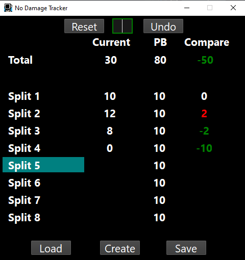

# No Damage Tracker

A simple tracker for tracking hits or damage per split. This program is intentionally lightweight and simple, and will show up to 8 splits at once. 

</img>


## Download
Download the latest release as a standalone executable. This program uses Python as an engine, but should be able to be ran by any compatible computer without any further installations.

## Setup
The only external file for this program are splits files. These are simply `.txt` files that can be created manually or in the program. The following format for each split is required, with nothing else:

```
Split A: 10
Split B: 5
Split C: 12
```

## Usage
Splits must be either created in the program via the `Create` command, or loaded using the `Load` command. Use `Start` command to begin tracking, then use the middle green-outlined box to enter hits per split using the Enter key. Pressing Enter without inputting a split will default to 0. The `Reset` command will be usable at any time, but using `Reset` after getting a PB will confirm to both save the splits as PB, and confirm if the user would like to save splits to the file. 

Note: Splits should be saved manually for updates, as the program will not check for saving splits upon being closed. Anytime a PB is achieved, the save splits dialog should appear anyhow. 


